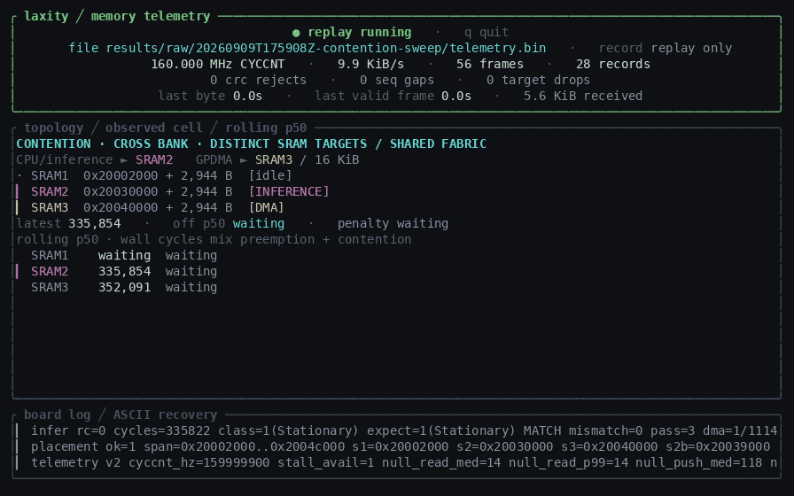
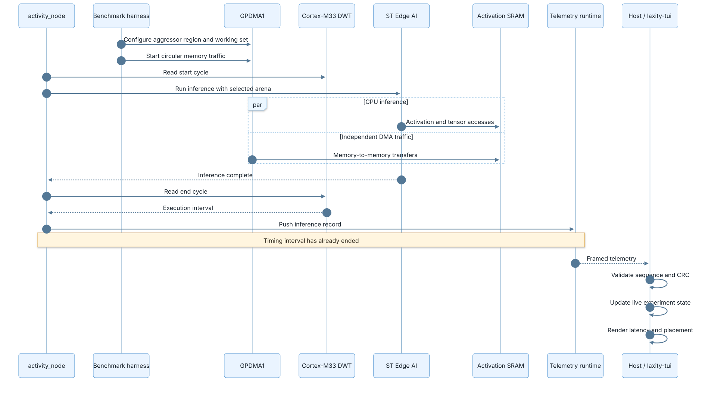

# Laxity



Moving a network's activation buffer between on-chip SRAM regions changes inference time on an STM32U585 by three cycles out of 320,898 when nothing else touches the bus, and by up to 31,189 when a DMA engine runs in the same region. Laxity is the instrument that measures both. Every figure below comes from one firmware image, since a relink alone moved the median by 85 cycles in earlier work and would otherwise explain the difference.

The target is a B-U585I-IOT02A running ThreadX, with inference generated by ST Edge AI Core.

## Result

Median inference time in cycles, by the region holding the activation arena and by the region the competing DMA master occupies.

| arena | no aggressor | DMA in SRAM1 | DMA in SRAM2 | DMA in SRAM3 |
| --- | --- | --- | --- | --- |
| SRAM1, 192 KiB | 320,898 | 337,877 | 320,927 | 335,843 |
| SRAM2, 64 KiB | 320,901 | 320,960 | 337,845 | 335,847 |
| SRAM3, 512 KiB | 320,899 | 320,967 | 320,937 | 352,088 |

The same region measured under two labels returned identical medians, so the noise floor is zero cycles at this sample size. SRAM1 and SRAM2 do not interfere with each other at all. Traffic in SRAM3 costs the other two about 4.7 percent each without sharing a region with either, and that asymmetry is not yet explained. The arena is 2,944 bytes because the network says so, so nothing here describes how the effect scales with arena size.

## How it works

One core, two masters. The core cannot contend with itself, so the competing traffic has to come from a DMA engine.



The layers, from the application down to the DWT counters.



One inference, from configuring the aggressor to the record reaching the host.



How a board run becomes a number.



Who runs what.


## Where things live

`firmware/stm32u585` holds the CubeMX project, the linker script and the generated HAL. Regenerate it with `tools/stm32/generate.sh` rather than by hand.

`runtime` and `include/qos` are the telemetry ring and the wire contract. The record is 32 bytes and its field offsets are asserted at compile time.

`platform/cortex-m33` and `platform/stm32u5` are the cycle counters and the SRAM region table, split so the counter code carries no vendor headers.

`bench` holds the GPDMA aggressor, the null probe that measures the measurement, and the sweep definitions.

`backend/stedgeai` is the converted network and the golden vector the firmware checks itself against on every pass.

`tools` is everything host-side. `tools/stm32/build.sh`, `flash.sh` and `capture.sh` drive the board, `tools/telemetry_parse.py` reads a capture, `tools/analyse.py` writes `RESULTS.md`, and `tools/laxity-tui` is the terminal monitor in the animation above.

`docs/diagrams` holds the Mermaid sources and the rendered SVGs. `assets` holds the screenshots.

## The name

Laxity, also called slack, is how much time a job can still lose before it misses its deadline.

```text
laxity = deadline - now - estimated_remaining_execution
```

A least laxity first scheduler runs the job with the smallest remaining laxity. Placement is worth treating the same way, as something a scheduler could spend, which is where the name comes from. See [least slack time scheduling](https://en.wikipedia.org/wiki/Least_slack_time_scheduling) and [Liu and Layland (1973)](https://doi.org/10.1145/321738.321743).

## License

```text
software: Apache-2.0

hardware designs, if they ever exist: CERN-OHL-P-2.0

third-party STMicroelectronics components: their respective ST licenses
```
