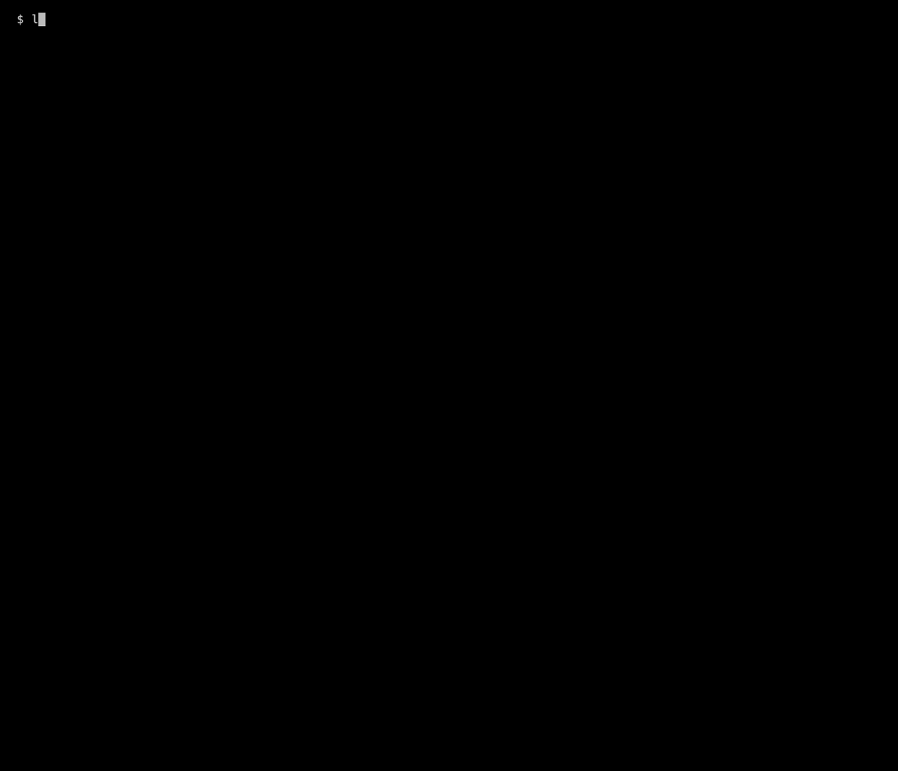
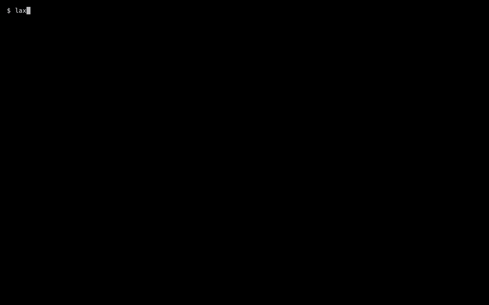
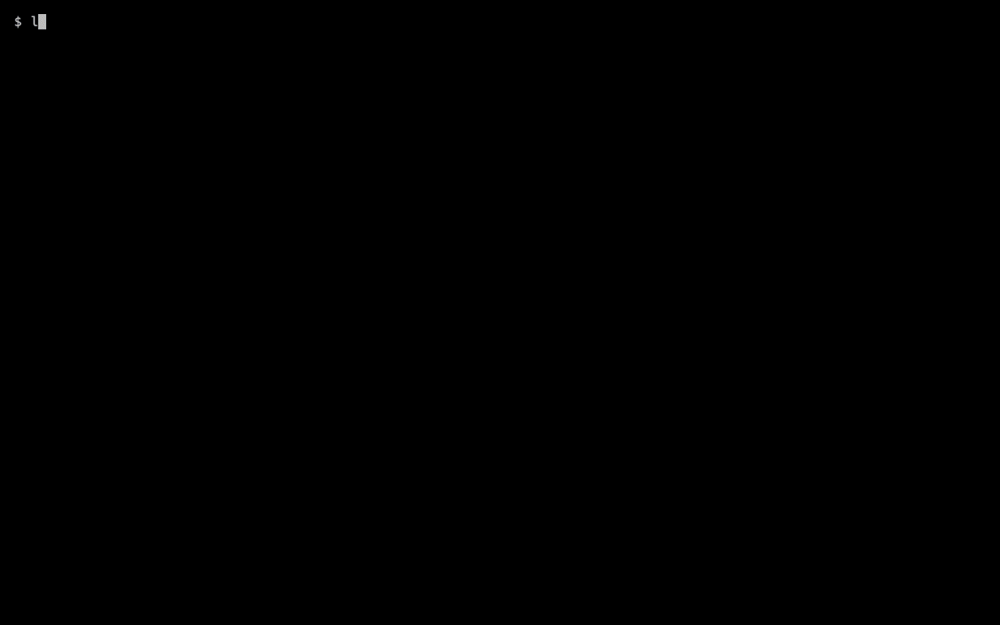

# Laxity

Laxity is middleware for neural inference on microcontrollers that share memory with DMA and peripherals. It sits between the application and the inference backend, selects the activation arena, and records what each pass costs. Its host tools connect those measurements to memory placement, so you can inspect which objects share a bank with competing traffic.


The reference integration runs on a B-U585I-IOT02A with an STM32U585, ThreadX and ST Edge AI Core. Arena selection currently lives in the reference firmware, while the application retains control of task scheduling. STM32U585 is the only measured hardware backend, so loading another platform profile does not establish its timing behaviour.

## What the middleware provides

- Switch between preallocated activation arenas without rebuilding the firmware for each placement.
- Record elapsed cycles alongside placement and requester activity, with sequence numbers and CRC checks to expose missing or damaged telemetry.
- Read allocated ELF symbols into a memory table, including objects that cross bank boundaries or fall outside the profile.
- Estimate contention from requester transaction rates and coefficients whose measurement origin stays attached to the result.
- Compare live and recorded inference timing in a terminal, with a memory view and per-configuration median and p99 values.
- Exercise the host tools without a board through recorded captures and deterministic telemetry scenarios.

The target integration selects the arena before calling the generated inference runtime. It measures the call with the Cortex-M33 cycle counter and sends the result through the telemetry ring. In the reference tests, a GPDMA channel supplies competing memory traffic while the firmware varies placement within one image. The measured interval can include thread preemption as well as memory contention, so attribution depends on the controlled comparison.

## The cost of sharing a bank

The model works at bank granularity, since contention depends on where the workload and the requester meet. A workload pays for traffic landing in banks occupied by its own objects. The requester's linked-list descriptor page also occupies memory, and fetching it contributes a separate term when it shares one of those banks.



The coefficients belong to the workload and the conditions under which it was measured. A coefficient from another part is an order of magnitude estimate, and a mean across configurations retains that qualification. The [experiment record](docs/experiments/README.md) describes how these rules were tested on STM32U585 and where the measurements stop.

## Audit without a board

The ELF audit combines a binary with a platform profile and a characterisation. The profile supplies the memory map and clock, while the characterisation carries coefficients and their origins. The application supplies its own timing window and deadline, since neither can be recovered from an ELF symbol table.



Run the object reader from the repository root to inspect a built image. It prints the largest allocated objects first, followed by byte totals and object counts per region. Objects spanning several regions retain every region name, and addresses outside the profile appear separately. The optional final argument controls the number of rows, with omitted objects counted in the output.

```sh
cargo run -p laxity-elf --example objects -- \
  build/target/laxity-u585.elf \
  profiles/stm32u585.toml \
  20
```

Run the reference audit to price its declared workload against the shipped characterisation. This example takes the window and deadline from the application config, while its object names and requester rates are declared in the example itself. The Rust API accepts those declarations from a caller.

```sh
laxity audit \
  build/target/laxity-u585.elf \
  profiles/stm32u585.toml \
  profiles/stm32u585.characterisation.toml \
  examples/stm32u585-reference/laxity.toml
```

<details>
<summary>Reference audit output</summary>



</details>

Each priced overlap carries its coefficient's origin, including the campaign image when one is recorded. Measured values, borrowed ranges and means across configurations remain distinguishable, and an upper bound is labelled as such. An unmeasured coefficient or missing traffic rate remains unknown. If a declared overlap has no price, the total explicitly becomes a lower bound with no upper bound available.

ELF symbols describe storage reserved at link time. The reference audit therefore sees the arena reservation and ThreadX byte pool, rather than the individual allocations made inside them at run time. It reports placement and estimated cost without relocating objects or applying a scheduling policy.

## Watch and record a run

Install the host command from the repository root, then check the toolchain and attached board. The installer links the checkout into `~/.local/bin` and reports any PATH change you need to make. The command uses Python with no required pip packages, and the viewer requires Rust.

```sh
./tools/install.sh
laxity doctor
```

Use `laxity run` to build, flash and record a campaign, then generate its analysis. Open `laxity tui` to watch subsequent telemetry over the ST-LINK serial port. Press `m` to cycle the telemetry, memory and audit views, and `Tab` to change what the current view displays. The viewer compares each configuration against its own requester-off baseline, because changing the placement also changes what the baseline must describe.

```sh
laxity run --seconds 75
laxity tui
```

Open a saved byte stream with `--file`, replacing `RUN` with your capture directory. Replay uses the same decoder and views as live input. The recordings below use synthetic streams from the checked-in scenarios, with the STM32U585 profile matching their placement addresses. They exercise the production telemetry writer and viewer without predicting hardware arbitration.

```sh
laxity tui --file results/raw/RUN/telemetry.bin
```

<details>
<summary>Memory placement on a live board</summary>



</details>

<details>
<summary>A selected cross-region cell on a live board</summary>


</details>

<details>
<summary>A rejected telemetry frame</summary>



</details>

The [VHS tapes](docs/tapes/README.md) reproduce these recordings. Three of them read an attached board over its serial port and the renderer refuses to record one when no board is streaming, so a missing board leaves the published image alone rather than replacing it with an empty screen. The rejected frame is replayed from `scenarios/` instead, since a corrupt frame is fault injection the firmware will not perform on request. Their renderer builds the current command before recording, so an older installed viewer cannot supply the GIFs.

```sh
./docs/tapes/render.sh
```

Use `laxity capture` and `laxity analyse` separately when the firmware is already built and flashed. Captures retain build metadata and image hashes alongside the raw stream, and analysis refuses incomplete evidence. A standalone TUI recording preserves received bytes but does not contain all the metadata needed for a campaign report. The [viewer documentation](crates/laxity-tui/README.md) covers UDP input, recording and source health.

## Repository layout

`include/qos` defines the telemetry contract and `runtime` implements its ring and framing. `platform/cortex-m33` supplies cycle counters, while `platform/stm32u5` holds the memory map and board services. The reference application and its placement loop live in `firmware/stm32u585`, with the generated model under `backend/stedgeai`. Hardware configuration belongs to the CubeMX project and is regenerated with `tools/stm32/generate.sh`.

`crates/laxity-elf` reads allocated symbols and `crates/laxity-core` evaluates placement costs. `crates/laxity-audit` joins them, using the shared types in `crates/laxity-types`. `profiles` keeps platform topology separate from measured characterisation, and `examples/stm32u585-reference/laxity.toml` declares the reference application's timing and objects.

`bench` holds the controlled requester and measurement probes used by the campaigns. `tools` contains the board commands, analysis and terminal viewer, with simulator inputs under `scenarios`. The Mermaid sources and generated SVGs live in `docs/diagrams`, and the [experiment record](docs/experiments/README.md) carries the measurement narrative.

## The name

Laxity, also called slack, is the time a job can still lose before missing its deadline. It accounts for both the time already spent and the execution still required. The name comes from least laxity first scheduling, where the job with the least remaining slack runs first.

```text
laxity = deadline - now - estimated_remaining_execution
```

## License

Software is licensed under [Apache-2.0](LICENSE). Any hardware designs are covered by CERN-OHL-P-2.0. Third-party STMicroelectronics components retain their respective ST licenses.
