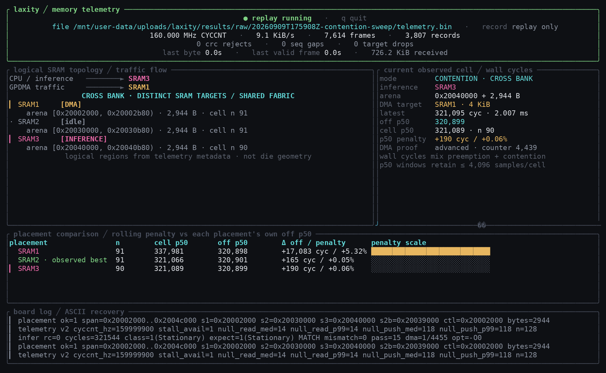
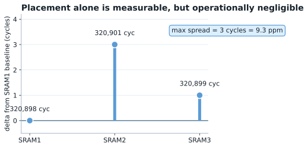
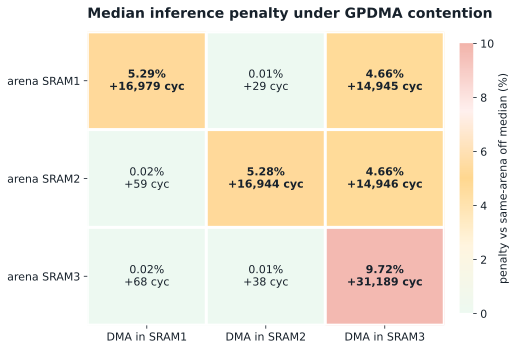
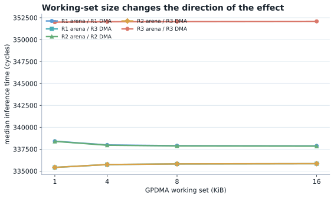
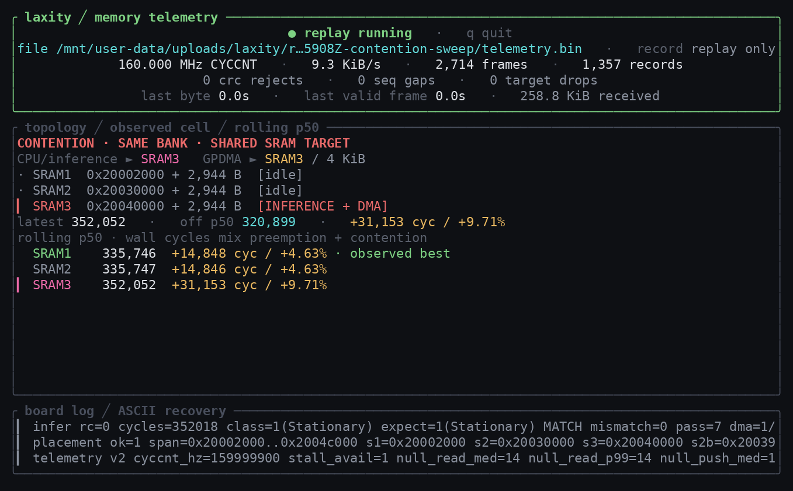

<!-- _class: title -->

# Laxity

Activation placement and memory contention in microcontroller-class neural inference

Alp O. Bolukbasi · Karlsruhe Institute of Technology · 10 September 2026

---

# The measured effect is almost zero until memory is shared

  

    
3 cycles

    
Maximum SRAM placement spread without a competing bus master, out of 320,898 cycles.

  

  

    
+31,189

    
Largest measured contention penalty, with inference and DMA in SRAM3.

  

  

    
+9.7%

    
Worst observed median penalty. SRAM3 also creates a cross-region asymmetry.

  

The claim is a measurement claim, not a scheduler claim. Laxity measures the cost that a later placement policy would need to model.

---

# The question is whether an arena address becomes a timing variable

A converted network normally treats its activation arena as a size constraint. If it fits, the exact SRAM address is usually left to the linker.

On the STM32U585, the core runs inference while DMA engines and sensor peripherals can move data independently. That creates a second requester for the memory system.

If placement only matters under contention, the useful scheduling signal is not "fast SRAM". It is the current relationship between the arena and the active bus masters.

---

<!-- _class: full-figure -->
# Laxity separates the embedded experiment from host-side measurement

Application, benchmark, platform support, telemetry, host analysis, and experiment tooling remain separate layers.

---

# Platform and placement space

- B-U585I-IOT02A with STM32U585, Cortex-M33 at 160 MHz
- ThreadX application environment
- ST Edge AI Core 4.0.1 inference backend
- Human activity recognition model trained on WISDM
- 24 samples across three axes, four output classes
- Activation arena: **2,944 bytes**
- Internal SRAM is not covered by the data cache on this part

  
<strong>SRAM1</strong> 192 KiB<code>0x20000000</code>

  
<strong>SRAM2</strong> 64 KiB<code>0x20030000</code>

  
<strong>SRAM3</strong> 512 KiB<code>0x20040000</code>

Three equally aligned arenas are allocated once. A pointer selects the active arena at run time, so the firmware image does not change between cells.

---

# GPDMA is the aggressor because a second thread would measure preemption

A Cortex-M33 has one core and no simultaneous multithreading. Two software threads therefore do not execute at the same instant.

A higher-priority aggressor thread would add its own execution to the measured interval. That mixes scheduler accounting with memory interference.

GPDMA1 is independent of the core. It performs circular memory-to-memory transfers while inference runs, with no DMA interrupt inside the measured interval.

---

# The measurement path is small enough to measure itself

  

    
14 cyc

    
Median and p99 cost of the cycle-counter read in the null probe.

  

  

    
118 cyc

    
Median record push cost, measured outside the inference timing interval.

  

  

    
32 B

    
Fixed telemetry record carrying timing, sequence, arena, and aggressor identity.

  

- DWT CYCCNT is 32 bits; wrap is detected and flagged.
- Records pass through an SPSC ring and framed transport with CRC.
- Sequence numbers advance on drop, so loss remains visible at the host.

---

# The sweep crosses arena placement with an independent memory master

- 3 arena regions × 3 DMA regions, plus aggressor-off baselines
- DMA working set: 1, 4, 8, and 16 KiB
- Additional controls estimate instrumentation and address-level noise
- Cells are visited in randomized order after warm-up
- Reported statistics: median and p99

The reported 180 s capture contains 9,062 records, 217 to 225 samples per cell, no drops, no sequence gaps, no CRC rejections, and one detected CYCCNT wrap.

---

<!-- _class: tui -->
# The TUI exposes the experiment cell instead of hiding it behind one latency number

Replay/live state, logical SRAM placement, DMA target, current cell, rolling p50, placement comparison, and raw board log remain visible together.

---

# Without contention, placement changes the median by three cycles

The uncontended medians are:

SRAM1  320,898 cyc SRAM2  320,901 cyc SRAM3  320,899 cyc

The full spread is **3 cycles**, or **9.3 parts per million**.

The control spread at this sample size is zero at the median. The effect is resolvable, but it is too small to act on.

---

# Contention changes the scale from single cycles to tens of thousands

Each cell is the median penalty against the same arena's aggressor-off median.

---

# SRAM3 is asymmetric, and the current experiment does not explain why

<h2>R1 and R2</h2>

Same-region contention costs about **5.3%**. Cross-region traffic between R1 and R2 stays near baseline at the 16 KiB working set.

<h2>R3 as aggressor</h2>

Traffic in R3 adds about **4.7%** to arenas in R1 and R2, even though the regions differ.

<h2>Reverse direction</h2>

R1 or R2 traffic adds only tens of cycles to an arena in R3.

R3 + R3 reaches +31,189 cycles, or +9.7%. The transfer counter advances at the same rate across regions, so the capture does not identify the internal arbitration point.

---

# Working-set size changes the direction of the effect

R1/R2 same-region penalties fall as the DMA buffer grows; R3 cross-region penalties rise. R3/R3 is almost flat.

---

# The synthetic master is a ceiling, not an operating point

The board also runs a sensing pipeline:

- inertial sensor sampled at 26 Hz
- environmental sensor
- microphone through the digital filter peripheral
- measured audio rate: 16,230 samples/s
- clock-chain prediction: 16,233 samples/s
- audio traffic: roughly 32 KiB/s
- audio buffer resides in SRAM3

The sensing pipeline is always on in the reported firmware. Its timing cost is therefore a baseline shift for the whole sensing workload, not an isolated microphone-on versus microphone-off result.

---

# The measurement has limits that stay attached to the claim

- Arena size is fixed at 2,944 B, so scaling with activation footprint is unknown.
- Measurements use optimization level zero, which lengthens inference.
- Each main region contributes one arena address, so region and address are partly confounded.
- The inertial sensor runs at 26 Hz while the training dataset used 20 Hz; this affects classification quality, not timing.

- The DMA channel changed after the audio driver claimed the first channel; equal-priority arbitration is assumed not to depend on channel index.
- Radio-driver threads add about 4%, but they preempt the inference thread, so that number mixes preemption with interference.
- The SRAM3 mechanism remains unresolved.

The data supports the asymmetry. It does not support assigning that asymmetry to a specific undocumented internal bus path.

---

# Laxity currently measures the cost model; the placement policy is future work

<h2>Implemented now</h2>

- run-time arena placement
- independent GPDMA interference
- cycle-accurate telemetry
- capture and replay
- per-cell comparison and analysis
- live memory-topology TUI

<h2>Deliberately not claimed yet</h2>

- automatic planner
- admission control
- optimal placement policy
- automatic migration

A policy would consume the per-region costs measured here instead of assuming one SRAM is globally best.

---

# What the measurements support

  

    
9.3 ppm

    
Placement effect with an idle memory system.

  

  

    
5.3%

    
Same-region contention in SRAM1 and SRAM2.

  

  

    
9.7%

    
Largest measured penalty, in SRAM3.

  

Activation placement becomes a useful scheduling signal when the memory system is shared. The open problem is the SRAM3 topology that a future cost model must represent.

<code>github.com/alpblkba/laxity</code>

---

# References

[1] C. L. Liu and J. W. Layland, "Scheduling algorithms for multiprogramming in a hard-real-time environment," JACM, 1973.

[2] R. Banakar et al., "Scratchpad memory: a design alternative for cache on-chip memory in embedded systems," CODES, 2002.

[3] O. Avissar, R. Barua, and D. Stewart, "An optimal memory allocation scheme for scratch-pad-based embedded systems," ACM TECS, 2002.

[4] S. Steinke et al., "Assigning program and data objects to scratchpad for energy reduction," DATE, 2002.

[5] H. Yun et al., "MemGuard: memory bandwidth reservation system for efficient performance isolation in multi-core platforms," RTAS, 2013.

[6] H. Yun et al., "PALLOC: DRAM bank-aware memory allocator for performance isolation on multicore platforms," RTAS, 2014.

[7] H. Kim et al., "Bounding memory interference delay in COTS-based multi-core systems," RTAS, 2014.

[8] R. Pellizzoni et al., "A predictable execution model for COTS-based embedded systems," RTAS, 2011.

[9] R. David et al., "TensorFlow Lite Micro: embedded machine learning for TinyML systems," MLSys, 2021.

[10] C. Banbury et al., "MLPerf Tiny benchmark," NeurIPS Datasets and Benchmarks, 2021.

[11] J. Lin et al., "MCUNet: tiny deep learning on IoT devices," NeurIPS, 2020.

[12] J. Lin et al., "MCUNetV2: memory-efficient patch-based inference for tiny deep learning," NeurIPS, 2021.

[13] J. R. Kwapisz, G. M. Weiss, and S. A. Moore, "Activity recognition using cell phone accelerometers," ACM SIGKDD Explorations, 2010.

